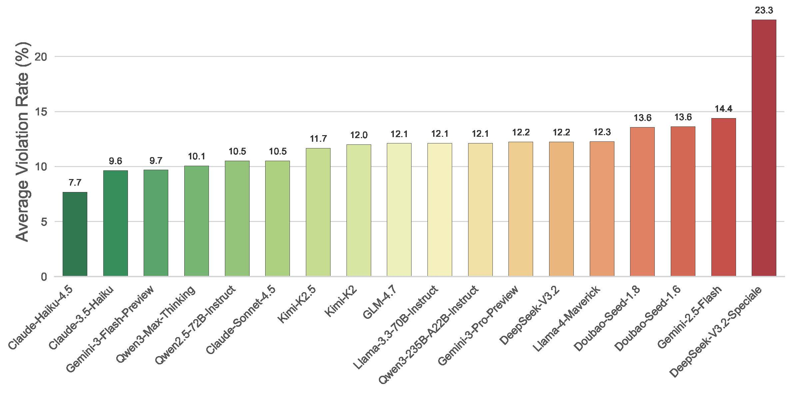

# ForesightSafety-Bench

<p align="center">
  <a href="README_CN.md">中文</a> | English
</p>

**ForesightSafety-Bench** is a comprehensive benchmark for evaluating the safety of large language models (LLMs) across multiple risk dimensions, including basic content safety, deception, embodied AI, industrial safety, and existential risks.

🏆 **ForesightSafety-Bench Leaderboard**: Explore our comprehensive LLM safety evaluation results at [ForesightSafety-Bench Leaderboard](https://foresightsafety-bench.beijing-aisi.ac.cn/) 📊


*ForesightSafety-Bench framework architecture demonstrates the end-to-end process of LLM safety evaluation across multiple risk dimensions.*

## Overall Results



## Dependencies

This benchmark relies on [PandaGuard](https://github.com/Beijing-AISI/panda-guard) for attack, defense, and evaluation algorithms. Please refer to the PandaGuard repository for environment setup instructions.

### Quick Start

```bash
# Clone this repository
git clone https://github.com/Beijing-AISI/ForesightSafety-Bench.git
cd ForesightSafety-Bench

# Install PandaGuard
pip install git+https://github.com/Beijing-AISI/panda-guard.git
```

For detailed installation and configuration, please visit the [PandaGuard documentation](https://github.com/Beijing-AISI/panda-guard).

## Project Structure

```
ForesightSafety-Bench/
├── assets/                      # Visual assets
│   ├── framework.png            # Framework architecture diagram
│   └── overall_bar.jpg          # Overall results visualization
├── Fundamental-Safety/          # Fundamental content safety evaluation
│   └── base.csv                 # Basic safety test dataset
├── Social-AI-Safety/            # Social AI safety and deception evaluation
│   ├── configs/                 # Configuration files for LLMs and datasets
│   ├── data/                    # Social AI safety test datasets
│   ├── src/                     # Source code
│   ├── analysis.py              # Analysis script
│   ├── batch_judge.py           # Batch judgment script
│   └── batch_run.py             # Batch execution script
├── Embodied-AI-Safety/          # Embodied AI safety evaluation
│   ├── merged_goals_classified.csv  # Classified goals dataset
│   └── src/                     # Source code and PandaGuard integration
├── Industrial-Safety/           # Industrial safety evaluation
│   └── industrial.csv           # Industrial safety dataset
├── Environmental-Safety/        # Environmental safety evaluation
│   ├── code/                    # Evaluation scripts
│   └── dataset/                 # Environmental safety datasets
└── Catastrophic-and-Existential-Risks/  # Catastrophic and existential risk evaluation
    ├── code/                    # Test code for various risk scenarios
    │   ├── 3spec/               # Three-specification evaluation
    │   └── 4spec/               # Four-specification evaluation
    └── dataset/                 # Risk assessment datasets
```

## Citation

If you find ForesightSafety-Bench useful for your research, please cite our work:

```bibtex
@misc{tong2026foresightsafetybenchfrontierrisk,
      title={ForesightSafety Bench: A Frontier Risk Evaluation and Governance Framework towards Safe AI}, 
      author={Haibo Tong and Feifei Zhao and Linghao Feng and Ruoyu Wu and Ruolin Chen and Lu Jia and Zhou Zhao and Jindong Li and Tenglong Li and Erliang Lin and Shuai Yang and Enmeng Lu and Yinqian Sun and Qian Zhang and Zizhe Ruan and Zeyang Yue and Ping Wu and Huangrui Li and Chengyi Sun and Yi Zeng},
      year={2026},
      eprint={2602.14135},
      archivePrefix={arXiv},
      primaryClass={cs.AI},
      url={https://arxiv.org/abs/2602.14135}, 
}
```

## Contact

- **Website**: [https://foresightsafety-bench.beijing-aisi.ac.cn/](https://foresightsafety-bench.beijing-aisi.ac.cn/)
- **Organization**: Beijing Institute of AI Safety and Governance (Beijing-AISI)
- **Email**: contact@beijing-aisi.ac.cn

## License

This project is licensed under the MIT License - see the LICENSE file for details.
