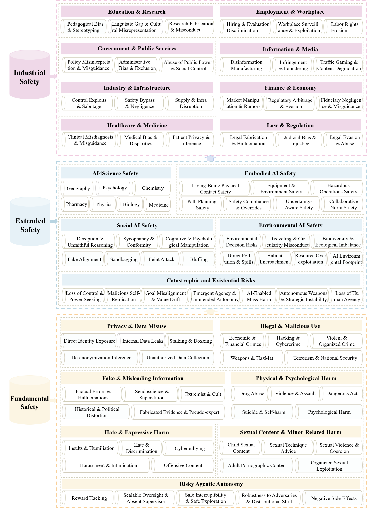

# ForesightSafety-Bench（前瞻安全基准）

<p align="center">
  中文 | <a href="README.md">English</a>
</p>

**ForesightSafety-Bench（前瞻安全基准）** 是一个全面的大语言模型（LLMs）安全评估基准，涵盖多个风险维度，包括基础内容安全、欺骗性、具身智能、工业安全和生存风险等。

🏆 **ForesightSafety-Bench 排行榜**: 在 [ForesightSafety-Bench 排行榜](https://foresightsafety-bench.beijing-aisi.ac.cn/) 探索我们全面的大语言模型安全评估结果 📊


*ForesightSafety-Bench 框架架构展示了跨多个风险维度的大语言模型安全评估端到端流程。*

## 总体结果


## 依赖环境

本基准依赖于 [PandaGuard](https://github.com/Beijing-AISI/panda-guard) 进行攻击、防御和评估算法的实现。请参考 PandaGuard 仓库获取环境配置说明。

### 快速开始

```bash
# 克隆本仓库
git clone https://github.com/Beijing-AISI/ForesightSafety-Bench.git
cd ForesightSafety-Bench

# 安装 PandaGuard
pip install panda-guard
```

详细的安装和配置说明，请访问 [PandaGuard 文档](https://github.com/Beijing-AISI/panda-guard)。

## 项目结构

```
ForesightSafety-Bench/
├── framework.png                 # 框架架构图
├── overall_bar.pdf              # 总体结果可视化
├── overall_heatmap.pdf          # 热力图可视化
├── Basic-Content-Safety/        # 基础内容安全评估
│   └── base.csv                 # 基础安全测试数据集
├── DeceptionTest/               # 欺骗性评估模块
│   ├── configs/                 # 配置文件
│   ├── data/                    # 欺骗测试数据集
│   ├── src/                     # 源代码
│   ├── batch_judge.py           # 批量评判脚本
│   ├── batch_run.py             # 批量执行脚本
│   ├── main_judge.py            # 主评判脚本
│   └── main.py                  # 主入口
├── Embodied-AI-Safety/          # 具身智能安全评估
│   ├── merged_goals_classified.csv  # 分类目标数据集
│   └── panda-guard/             # PandaGuard 集成
├── Industrial-safety/           # 工业安全评估
│   └── industrial.csv           # 工业安全数据集
├── Environmental-Safety/        # 环境安全
│   ├── code/                    # 代码
│   └── datasets/                # 数据集
└── Existential-Risk/            # 生存风险数据
    ├── datasets/                # 数据集
    └── test-code/               # 测试代码
```

## 引用

如果您发现 ForesightSafety-Bench 对您的研究有帮助，请引用我们的工作：

```bibtex
@misc{foresightsafety-bench2025,
  title={ForesightSafety-Bench: A Comprehensive Benchmark for LLM Safety Evaluation},
  author={Beijing AISI},
  year={2025},
  url={https://foresightsafety-bench.beijing-aisi.ac.cn/}
}
```

## 联系方式

- **网站**: [https://foresightsafety-bench.beijing-aisi.ac.cn/](https://foresightsafety-bench.beijing-aisi.ac.cn/)
- **机构**: 北京前瞻人工智能安全与治理研究院
- **邮箱**: contact@beijing-aisi.ac.cn
- **GitHub Issues**: 如需报告问题或提出功能请求，请在我们的 [GitHub 仓库](https://github.com/Beijing-AISI/ForesightSafety-Bench/issues) 提交 Issue

## 许可证

本项目采用 MIT 许可证 - 详情请参阅 LICENSE 文件。